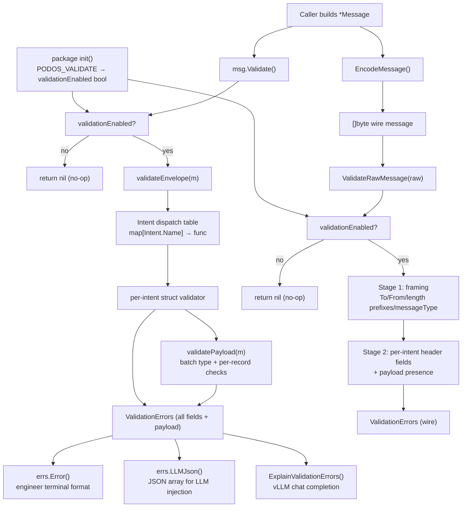

# Intent Field Validation

## Objectives

1. Ensure API handlers, structs, and functions are correct — validate `*Message` before encoding.
2. Validate raw Message serialization/deserialization to assist engineers and LLMs in coding and implementation.
3. Validation must identify what's wrong **and how to fix it**, with output consumable by both human engineers and LLMs.

## Pending code changes (required before validate.go)

These changes must be applied to the codebase before implementing the validator, as the validator will reflect the corrected behavior.

`**message/intents.go`** — Remove deprecated intents:

- Remove `UpdateBatchTags` from `intentTypes` struct and `newIntentTypes()`
- Remove `UpdateBatchTagsResponse` from `intentTypes` struct and `newIntentTypes()`
- Remove `"update_tag_batch"` entry from `commandToIntent` map
- Remove `"update_tag_batch"` entry from `commandToResponseIntent` map
- `StoreBatchTagsResponse` covers the update use case; no backward compatibility needed

`**message/header.go` — `LinkEventsMessageHeader`** — Move link-event-specific fields from `msg.Event.*` to `msg.NeuralMemory.Link.*`:

- `msg.Event.Timestamp` → `msg.NeuralMemory.Link.Timestamp`
- `msg.Event.Location` → `msg.NeuralMemory.Link.Location`
- `msg.Event.LocationSeparator` → `msg.NeuralMemory.Link.LocationSeparator`
- `msg.Event.Type` → `msg.NeuralMemory.Link.Type`
- Note: `msg.Event.Id/UniqueId/Owner` at the top of the function correctly identify the link-creation event object and do NOT change.

`**message/header.go` — `UnlinkEventsMessageHeader**` — Use `msg.NeuralMemory.Link.*` for event identification (keeps Link struct consistent across all link operations):

- `msg.Event.Id` → `msg.NeuralMemory.Link.Id`
- `msg.Event.UniqueId` → `msg.NeuralMemory.Link.UniqueId`
- `msg.Event.Owner` → `msg.NeuralMemory.Link.Owner`

## Environment gate — zero cost when disabled

Validation must never run unless explicitly enabled, because the check runs on every message and could degrade performance and increase UPL in high-throughput deployments.

The gate is a single env var read **once at package init** (not on every call):

```go
// validationEnabled is set once at package init from PODOS_VALIDATE env var.
// Accepted values: "1", "true", "yes" (case-insensitive). Anything else disables.
var validationEnabled bool

func init() {
    v := strings.ToLower(strings.TrimSpace(os.Getenv("PODOS_VALIDATE")))
    validationEnabled = v == "1" || v == "true" || v == "yes"
}
```

Both `Validate()` and `ValidateRawMessage()` return `nil` immediately when `!validationEnabled`. This makes the hot path a single bool check with no allocations.

## Solution: One new file — `message/validate.go`

### Dual-audience error types (Gap 15)

Every error produced by the validator must be consumable by two audiences with different needs.

`**ValidationError` struct:**

```go
type ValidationError struct {
    Severity    string   // "error" or "warn"
    Intent      string   // Intent name, e.g. "LinkEvent"
    Field       string   // Go struct dot-path: "NeuralMemory.Link.Category"
    WireField   string   // Wire protocol key: "category"
    Rule        string   // "required", "one_of_required", "format", "nil_struct",
                         // "header_missing", "header_value", "payload_type",
                         // "payload_format", "uncovered"
    Message     string   // Human-readable description of what is wrong
    Fix         string   // Concrete remediation step in plain English
    ExampleCode string   // Minimal Go snippet showing a correct value
    References  []string // Source locations: "message/types.go:LinkFields.Category"
}
```

**Engineer format** — `(e ValidationErrors) Error() string`:
One line per error, terminal-friendly:

```
[ERROR] LinkEvent / NeuralMemory.Link.Category (category): required
  What: Category is required for LinkEvent and is missing.
  Fix:  Set NeuralMemory.Link.Category to a non-empty string (e.g. "related").
  Code: msg.NeuralMemory.Link.Category = "related"
```

WARN lines use `[WARN]` prefix. Empty `ValidationErrors` produces `""`.

**LLM format** — `(e ValidationErrors) LLMJson() string`:
A JSON array, one object per error, suitable for injection into a prompt or tool-call response:

```json
[{
  "severity": "error",
  "intent": "LinkEvent",
  "struct_path": "NeuralMemory.Link.Category",
  "wire_field": "category",
  "rule": "required",
  "description": "Category is required for LinkEvent and is missing.",
  "fix": "Set NeuralMemory.Link.Category to a non-empty string identifying the semantic relationship.",
  "example_code": "msg.NeuralMemory.Link.Category = \"related\"",
  "references": ["message/types.go:LinkFields.Category", "message/header.go:LinkEventsMessageHeader"]
}]
```

### AI-assisted remediation via vLLM (Gap 1)

An optional function submits errors to a vLLM-hosted endpoint for enhanced diagnostics. The endpoint must implement the OpenAI-compatible `/v1/chat/completions` interface.

```go
// ExplainValidationErrors submits errors to a vLLM endpoint for AI-assisted remediation.
// endpoint: base URL, e.g. "http://localhost:8000"
// Returns an AI-generated explanation and corrected code snippet, or an error.
func ExplainValidationErrors(errs ValidationErrors, endpoint string) (string, error)
```

**Prompt template per error** (sent as `user` message in the chat completion):

```
You are a Pod-OS Go client expert. A message validation error occurred.

Intent: {{.Intent}}
Struct Path: {{.Field}}
Wire Field: {{.WireField}}
Rule Violated: {{.Rule}}
Description: {{.Message}}
Suggested Fix: {{.Fix}}
Example Code: {{.ExampleCode}}
Source References: {{join .References ", "}}

Task: Provide corrected Go code for this message construction. Show all required fields for the {{.Intent}} intent. If multiple valid approaches exist (e.g. EventA/EventB vs UniqueIdA/UniqueIdB), show both. Use only types from the message package.
```

**vLLM tool assignments:**

- Generative Model (e.g. Llama/Mistral): produce corrected code and natural-language explanation
- Transformer RL (reward-tuned for code correctness): rank candidate fixes by likelihood of producing a valid wire message
- Retrieval (RAG over this plan + source files): surface the specific header builder and struct definition relevant to the error

### `(m *Message) Validate() ValidationErrors`

Returns `nil` immediately if `!validationEnabled`. Otherwise returns all violations at once (not just the first). Dispatches in three layers:

1. **Envelope** (all intents):

- `To` non-nil and matches `name@gateway` format
- `From` non-nil and matches `name@gateway` format
- `Intent` must be non-zero
- If `GatewayId`, `ClientName` required
- `Envelope.MessageId` mapped to `_msg_id` OPTIONAL

1. **Intent dispatch table** (`map[string]func(*Message) ValidationErrors`): each key is `Intent.Name`.
2. Per-intent private validator functions (one per intent)

### Per-Intent validation rules

**Nil-guard convention:** All validators must check the relevant top-level struct pointer (`Event`, `NeuralMemory`, `NeuralMemory.Link`, etc.) before dereferencing any field. A nil struct produces a `Rule: "nil_struct"` error with a Fix directing the caller to initialize it. This applies to both struct validation (`Validate()`) and wire validation (`ValidateRawMessage()`).

`**UpdateBatchTags` and `UpdateBatchTagsResponse` are deprecated and removed.** `StoreBatchTagsResponse` covers the update use case. Both intents have been deleted from `intents.go`, `commandToIntent`, and `commandToResponseIntent`.

**StoreEvent**
{Intent}

- `Intent.Name` = "StoreEvent"
- `Intent.NeuralMemoryCommand` = `store`
- `Intent.MessageType` = 1000
{Header}
- format: tab-separated field=value
- `Event` non-nil; REQUIRED
- `Intent.Name` mapped to `_db_cmd` = `store`
- `Event.Timestamp` mapped to `timestamp` — included automatically if empty (warn via `Rule: "required"`) REQUIRED
- `Event.Owner` mapped to `owner` OR `Event.OwnerUniqueID` mapped to `owner_unique_id` REQUIRED
- `Event.Location` mapped to `loc` REQUIRED
- `Event.LocationSeparator` mapped to `loc_delim` REQUIRED
- `Event.Id` mapped to `event_id` OPTIONAL
- `Event.UniqueId` mapped to `unique_id` OPTIONAL
- `Event.OwnerUniqueID` mapped to owner_unique_id OPTIONAL
- `Event.Type` mapped to `type` OPTIONAL
- `Event.PayloadData.MimeType` mapped to `mime` OPTIONAL
- `Envelope.MessageId` mapped to `_msg_id` OPTIONAL
{Payload}
- `Event.PayloadData.Data` appended after header block OPTIONAL
- `Event.PayloadData.DataType` mapped to payloadDataType in EncodeMessage() OPTIONAL

**StoreEventResponse**
{Intent}

- `Intent.Name` = "StoreEventResponse" 
- `Intent.NeuralMemoryCommand` = `store`
- `Intent.MessageType` = 1001
{Header}
- format: tab-separated field=value
- `Event` non-nil REQUIRED
- `Event.Id` mapped from `_event_id` REQUIRED
- `Event.LocalId` mapped from `_event_local_id` REQUIRED
- `Event.UniqueId` mapped from `unique_id` OPTIONAL
- `Event.Type` mapped from `_type` OPTIONAL
- `Envelope.MessageId` mapped from `_msg_id` OPTIONAL
- `Response.Status` mapped from `_status` REQUIRED
- `Response.Message` mapped from `_msg` REQUIRED
- `Response.TotalEvents` mapped from `_count` REQUIRED
- `Response.TagCount` mapped from `_tag_count` REQUIRED

**StoreBatchEvents**

- Newline separated events composed of event + tags
{Intent}
- `Intent.NeuralMemoryCommand` = `store_batch`
- `Intent.MessageType` = 1000
{Header}
- format: tab-separated field=value
- `Intent.Name` mapped to `_db_cmd` = `store_batch` REQUIRED
- `Envelope.MessageId` mapped to `_msg_id` OPTIONAL
{Payload}
- Event.Payload non-nil; Event.Payload of type `[]BatchEventSpec` REQUIRED

**BatchEventSpec**
{Event}

- Event is output as tab-delimited event fields; format: field=
- `Event` non-nil (required by `StoreEventMessageHeader`) REQUIRED
- `Event.Timestamp` mapped to `timestamp` — included automatically if empty (warn via `Rule: "required"`) REQUIRED
- `Event.Owner` mapped to `owner` OR `Event.OwnerUniqueID` mapped to `owner_unique_id` REQUIRED
- `Event.Location` mapped to `loc` REQUIRED
- `Event.LocationSeparator` mapped to `loc_delim` REQUIRED
- `Event.Id` mapped to `event_id` OPTIONAL
- `Event.UniqueId` mapped to `unique_id` OPTIONAL
- `Event.OwnerUniqueID` mapped to owner_unique_id OPTIONAL
- `Event.Type` mapped to `type` OPTIONAL
- `Event.PayloadData.MimeType` mapped to `mime` OPTIONAL
- `Envelope.MessageId` mapped to `_msg_id` OPTIONAL
{Tags}
- `Tag.Frequency`, `Tag.Key`, `Tag.Value` mapped to `tag_i=freq:key=value\t` where i is the slice position and the tab-delimited tags are appended to each event
- `Tag.Owner` mapped to tag owner OPTIONAL
- `Tag.OwnerUniqueID` mapped to tag owner unique identifier OPTIONAL

**StoreBatchEventsResponse**
{Intent}

- `Intent.Name` = "StoreBatchEventsResponse"
- `Intent.NeuralMemoryCommand` = `store_batch`
- `Intent.MessageType` = 1001
{Header}
- format: tab-separated field=value
- `Event` non-nil REQUIRED
- `Event.Id` mapped from `_event_id` REQUIRED
- `Event.LocalId` mapped from `_event_local_id` REQUIRED
- `Event.UniqueId` mapped from `unique_id` OPTIONAL
- `Event.Type` mapped from `_type` OPTIONAL
- `Event.Owner` mapped from `_event_owner` REQUIRED
- `Envelope.MessageId` mapped from `_msg_id` OPTIONAL
- `Response.Status` mapped from `_status` REQUIRED
- `Response.Message` mapped from `_msg` REQUIRED
- `Response.TotalEvents` mapped from `_count` REQUIRED

**StoreBatchTags**

- Newline separated events composed of event + tags
{Intent}
- `Intent.Name` = `StoreBatchTags`
- `Intent.NeuralMemoryCommand` = `tag_store_batch`
- `Intent.MessageType` = 1000
{Header}
- format: tab-separated field=value
- `Intent.Name` mapped to `_db_cmd` = `tag_store_batch` REQUIRED
- `Event.Id` mapped to `event_id` OR `Event.UniqueId` mapped to `unique_id` REQUIRED
- `Event.Owner` mapped to `owner` OR `Event.OwnerUniqueID` mapped to `owner_unique_id` REQUIRED
- `Envelope.MessageId` mapped to `_msg_id` OPTIONAL
{Payload}
- Event.Payload non-nil; Event.Payload of type `NeuralMemory.Tags` REQUIRED
`TagList`
- `Tag.Frequency`, `Tag.Key`, `Tag.Value` mapped to `freq=key=value\n`
- `Tag.Owner` mapped to tag owner OPTIONAL
- `Tag.OwnerUniqueID` mapped to tag owner unique identifier OPTIONAL

**StoreBatchTagsResponse**
{Intent}

- `Intent.Name` = "StoreBatchTagsResponse"
- `Intent.NeuralMemoryCommand` = `tag_store_batch`
- `Intent.MessageType` = 1001
{Header}
- format: tab-separated field=value
- `Event` non-nil REQUIRED
- `Event.Id` mapped from `_event_id` REQUIRED
- `Event.LocalId` mapped from `_event_local_id` REQUIRED
- `Event.UniqueId` mapped from `unique_id` OPTIONAL
- `Event.Type` mapped from `_type` OPTIONAL
- `Event.Owner` mapped from `_event_owner` OPTIONAL
- `Envelope.MessageId` mapped from `_msg_id` OPTIONAL
- `Response.Status` mapped from `_status` REQUIRED
- `Response.Message` mapped from `_msg` REQUIRED
- `Response.TotalEvents` mapped from `_count` OPTIONAL
- `Response.TotalTags` mapped from `_tag_count` OPTIONAL

**GetEvent**
{Intent}

- `Intent.Name` = "GetEvent"
- `Intent.NeuralMemoryCommand` = `get`
- `Intent.MessageType` = 1000
{Header}
- format: tab-separated field=value
- `Event` non-nil; REQUIRED
- `Intent.Name` mapped to `_db_cmd` = `get`
- `Event.Id` mapped to `event_id` OR `Event.UniqueId` mapped to `unique_id` REQUIRED
- `Event.Timestamp` mapped to `timestamp` — included automatically if empty (warn via `Rule: "required"`) OPTIONAL
- `Event.Location` mapped to `loc` OPTIONAL
- `Event.LocationSeparator` mapped to `loc_delim` OPTIONAL
- `Envelope.MessageId` mapped to `_msg_id` OPTIONAL
- `NeuralMemory.GetEvent.SendData` if true mapped to "send_data=Y" OPTIONAL
- `NeuralMemory.GetEvent.LocalIdOnly` if true mapped to "local_id_only=Y" OPTIONAL
- `NeuralMemory.GetEvent.GetTags` if true mapped to "get_tags=Y" OPTIONAL
- `NeuralMemory.GetEvent.GetLinks` if true mapped to "get_links=Y" OPTIONAL
- `NeuralMemory.GetEvent.GetLinkTags` if true mapped to "get_link_tags=Y" OPTIONAL
- `NeuralMemory.GetEvent.GetTargetTags` if true mapped to "get_target_tags=Y" OPTIONAL
- `NeuralMemory.GetEvent.EventFacetFilter` if not nil mapped to "event_facet_filter" OPTIONAL
- `NeuralMemory.GetEvent.LinkFacetFilter` if not nil mapped to "link_facet_filter" OPTIONAL
- `NeuralMemory.GetEvent.TargetFacetFilter` if not nil mapped to "target_facet_filter" OPTIONAL
- `NeuralMemory.GetEvent.CategoryFilter` if not nil mapped to "category_filter" OPTIONAL
- `NeuralMemory.GetEvent.TagFilter` if not nil mapped to "tag_filter" OPTIONAL
- `NeuralMemory.GetEvent.TagFormat` if nil mapped to "tag_format=0" else mapped to "tag_format"; supported values [0, 1] OPTIONAL
- `NeuralMemory.GetEvent.RequestFormat` if nil mapped to "request_format=0" else mapped to "request_format"; supported values [0, 1] OPTIONAL
- `NeuralMemory.GetEvent.FirstLink` if not nil mapped to "first_link" OPTIONAL
- `NeuralMemory.GetEvent.LinkCount` if not nil mapped to "link_count" OPTIONAL

**GetEventResponse**
{Intent}

- `Intent.Name` = "GetEventResponse"
- `Intent.NeuralMemoryCommand` = `get`
- `Intent.MessageType` = 1001
{Header}
- format: tab-separated field=value
- `Event` non-nil REQUIRED
- `Event.Id` mapped from `_event_id` REQUIRED
- `Event.LocalId` mapped from `_event_local_id` REQUIRED
- `Event.UniqueId` mapped from `unique_id` OPTIONAL
- `Event.Type` mapped from `_type` OPTIONAL
- `Event.Owner` mapped from `_event_owner` OPTIONAL
- `Envelope.MessageId` mapped from `_msg_id` OPTIONAL
- `Response.Status` mapped from `_status` REQUIRED
- `Response.Message` mapped from `_msg` REQUIRED
- `Response.TotalEvents` mapped from `_count` OPTIONAL
- `Response.TotalTags` mapped from `_tag_count` OPTIONAL
{Payload}
case: if Request NeuralMemory.GetEvent.SendData = true and no other GetEventOptions are set: Payload is a BLOB stored in Event.PayloadData,Data. 
- MimeType field mapped from `mime`; Event.PayloadData.Data from payload processing. If additional GetEventOptions are set, the SendData true bool is ignored.

case if Request NeuralMemory.GetEvent.GetEventOptions.GetTags = true and NeuralMemory.GetEvent.GetEventOptions.RequestFormat = 0:

- Newline separated tags
- If tags exist, do not duplicate in Payload.Data
- Format: event_tag:nnnnnnnnn:f=key=value where f is frequency; nnnnnnnnn is tag number and not needed for output.
- `Response.EventRecords.Tags` from event

case if GetEventOptions.GetLinks = true:

- Newline separated links; tab-separated fields
- Format: _link={linkId}	unique_id=	target_event=	target_unique_id=	strength=	link_time=	category=
- If links exist, do not duplicate in Payload.Data
- `Response.EventRecords.Links[]` from links

case if Request NeuralMemory.GetEvent.GetEventOptions.GetLinkTags = true:

- Newline separated tags; tab-separated fields
- Format: _linktag	event_id={linkId}	unique=	freq=	timestamp=	value=
- If tags exist, do not duplicate in Payload.Data
- `Response.EventRecords.Links.[]LinkFields` from tags

case if Request NeuralMemory.GetEvent.GetEventOptions.GetTargetTags = true:

- Newline separated tags; tab-separated fields
- Format: _target_event_tag	event_id={targetEventId}	unique=	freq=	timestamp=	value=
- If tags exist, do not duplicate in Payload.Data
- `Response.EventRecords.Links.[]LinkFields` from tags

**GetEventsForTags**
{Intent}

- `Intent.Name` = "GetEventsForTags"
- `Intent.NeuralMemoryCommand` = `events_for_tag`
- `Intent.MessageType` = 1000
{Header}
- format: tab-separated field=value
- `NeuralMemory` non-nil REQUIRED; `NeuralMemory.GetEventsForTags` non-nil REQUIRED
- NOTE: `msg.Event` is NOT required and NOT dereferenced by `GetEventsForTagMessageHeader`
- `Intent.Name` mapped to `_db_cmd` = `events_for_tag`
- `Envelope.MessageId` mapped to `_msg_id` OPTIONAL
- `NeuralMemory.GetEventsForTags.EventPattern` mapped to `event` OPTIONAL
- `NeuralMemory.GetEventsForTags.EventPatternHigh` mapped to `event_high` OPTIONAL
- `NeuralMemory.GetEventsForTags.IncludeBriefHits` mapped to `include_brief_hits` OPTIONAL
- `NeuralMemory.GetEventsForTags.GetAllData` mapped to`get_all_data` OPTIONAL # Get all tag and link data for all matching events, but disable the output of statistics for individual matching terms (equivalent to include_tag_stats=N)
- `NeuralMemory.GetEventsForTags.FirstLink` mapped to `first_link` OPTIONAL
- `NeuralMemory.GetEventsForTags.LinkCount` mapped to `link_count` OPTIONAL           
- `NeuralMemory.GetEventsForTags.EventsPerMessage` mapped to `events_per_message` OPTIONAL       
- `NeuralMemory.GetEventsForTags.StartResult` mapped to `start_result` OPTIONAL     
- `NeuralMemory.GetEventsForTags.EndResult`  mapped to `end_result` OPTIONAL
- `NeuralMemory.GetEventsForTags.MinEventHits`  mapped to `min_event_hits` OPTIONAL
- `NeuralMemory.GetEventsForTags.CountOnly`  mapped to `count_only` OPTIONAL
- `NeuralMemory.GetEventsForTags.GetMatchLinks`  mapped to `get_match_links` OPTIONAL
- `NeuralMemory.GetEventsForTags.CountMatchLinks`  mapped to `count_match_links` OPTIONAL
- `NeuralMemory.GetEventsForTags.GetLinkTags`  mapped to `get_link_tags` OPTIONAL
- `NeuralMemory.GetEventsForTags.GetTargetTags`  mapped to `get_target_tags` OPTIONAL
- `NeuralMemory.GetEventsForTags.LinkTagFilter`  mapped to `link_tag_pattern`  OPTIONAL
- `NeuralMemory.GetEventsForTags.LinkedEventsFilter`  mapped to `linked_events_tag_filter` OPTIONAL
- `NeuralMemory.GetEventsForTags.LinkCategory`  mapped to `link_category` OPTIONAL
- `NeuralMemory.GetEventsForTags.Owner`  mapped to `owner` OPTIONAL
- `NeuralMemory.GetEventsForTags.OwnerUniqueID`  mapped to `owner_unique_id` OPTIONAL
- `NeuralMemory.GetEventsForTags.GetEventObjectCount`  mapped to `get_eo_count`  OPTIONAL # Special flag requesting the total number of event objects in the database, regardless of type. No other operation is performed. The return message header will contain: event_count= where N is a numeric value.
- `NeuralMemory.GetEventsForTags.BufferResults` mapped to `buffer_results`  OPTIONAL
- `NeuralMemory.GetEventsForTags.IncludeTagStats` mapped to `include_tag_stats` OPTIONAL
- `NeuralMemory.GetEventsForTags.InvertHitTagFilter` mapped to `invert_hit_tag_filter` OPTIONAL
- `NeuralMemory.GetEventsForTags.HitTagFilter` mapped to `hit_tag_filter` OPTIONAL
- `NeuralMemory.GetEventsForTags.BufferFormat` mapped to `buffer_format` OPTIONAL

**GetEventsForTagsResponse**
BufferResults case: if Request NeuralMemory.GetEventsForTags.BufferResults = 'Y': 
  Brief Hit case: if {Payload} has "_brief_hit":
    {Intent}
    - `Intent.Name` = "GetEventsForTagsResponse"
    - `Intent.NeuralMemoryCommand` = `events_for_tags`
    - `Intent.MessageType` = 1001
    {Header}
    - format: tab-separated field=value
    - `Event.Type` mapped from `_type` OPTIONAL
    - `Envelope.MessageId` mapped from `_msg_id` OPTIONAL
    - `Response.Status` mapped from `_status` OPTIONAL
    - `Response.Message` mapped from `_msg` OPTIONAL

```
{Payload}
- If _brief_hit exists, no other output types (_event_id, _link, _linktag, _targettag) are included.
- Format: newline-terminated records with tab-separated fields stored in Response.BriefHits []BriefHitRecord
-- BriefHitRecord.EventId mapped from `_brief_hit=`
-- BriefHitRecord.TotalHits mapped from `_hits=` — total number of matching tag hits for this event
```

  Count Only case: if Request NeuralMemory.GetEventsForTags.CountOnly = 'Y':
    {Intent}
    - `Intent.Name` = "GetEventsForTagsResponse"
    - `Intent.NeuralMemoryCommand` = `events_for_tags`
    - `Intent.MessageType` = 1001
    {Header}
    - format: tab-separated field=value
    - `Event.Type` mapped from `_type` OPTIONAL
    - `Envelope.MessageId` mapped from `_msg_id` OPTIONAL
    - `Response.Status` mapped from `_status` REQUIRED
    - `Response.TotalEvents` mapped from `_count` REQUIRED
    - `Response.MatchTermCount` mapped from `_hits` REQUIRED — total number of matching tag hits across all events

  Else:
    {Intent}
    - `Intent.Name` = "GetEventsForTagsResponse"
    - `Intent.NeuralMemoryCommand` = `events_for_tags`
    - `Intent.MessageType` = 1001
    {Header}
    - format: tab-separated field=value
    - `Event.Type` mapped from `_type` OPTIONAL
    - `Event.Owner` mapped from `_event_owner` OPTIONAL
    - `Envelope.MessageId` mapped from `_msg_id` OPTIONAL
    - `Response.Status` mapped from `_status` REQUIRED
    - `Response.Message` mapped from `_msg` OPTIONAL
    - `Response.TotalEvents` mapped from `_total_event_hits` REQUIRED
    - `Response.ReturnedEvents` mapped from `_returned_event_hits` REQUIRED 

```
{Payload}
- BufferFormat case: if Request NeuralMemory.GetEventsForTags.BufferFormat = 0
-- newline separated records; returned as Response.EventRecords[]
-- each Event is compiled from the events, and links below. Link are built from _link, _linktag and _target_tag fields base on the Id. 
-- Case line has prefix `_event_id`:
--- format: tab-separated field=value
--- `Event` non-nil REQUIRED
--- `Event.Id` mapped from `_event_id` REQUIRED
--- `Event.UniqueId` mapped from `tag:{n}:unique_id` OPTIONAL
--- `Event.Tags` mapped from tab-separated tags; format: tag:freq:key=value
--- `EventFields.Hits` mapped from `_hits` REQUIRED — total search term match hits for this individual event object (type: int, field added to EventFields in types.go)

-- case line has prefix `_link`:
--- format: tab-separated field=value
--- `Response.EventRecords.Event.Links` non-nil REQUIRED
--- `Link.Id` mapped from `_link`_ REQUIRED
--- `Link.EventA` mapped from `source` REQUIRED
--- `Link.EventB` mapped from `target` REQUIRED
--- `Link.Category` mapped from `category` REQUIRED
--- `Link.UniqueIdB` mapped from `target_unique_id` OPTIONAL


-- case line has prefix `_linktag`: 
--- format: tab-separated field=value
--- `Response.EventRecords.Event.Links.Link.Tags` non-nil REQUIRED
--- _linktag= defines corresponding Link.Id REQUIRED
--- `value=` mapped to format: {Tag.Key}={Tag.Value} REQUIRED
--- `freq=` mapped to `Tag.Frequency` OPTIONAL
--- `owner` mapped to `Tag.Owner` OPTIONAL
--- `timestamp` mapped to `Tag.timestamp` OPTIONAL


-- case line has prefix `_targettag`:
--- format: tab-separated field=value
--- `Response.EventRecords.Event.Links.Link.TargetTags` non-nil REQUIRED
--- _targettag_= mapped to `Tag.TargetTagId` REQUIRED
--- `value=` mapped to format: {`Tag.Key`}={`Tag.Value`} REQUIRED
--- `freq=` mapped to `Tag.Frequency` OPTIONAL
--- `owner` mapped to `Tag.Owner` OPTIONAL
--- `timestamp` mapped to `Tag.timestamp` OPTIONAL
```

- BufferFormat case: if Request NeuralMemory.GetEventsForTags.BufferFormat = 1 → return `ValidationError{Severity:"warn", Rule:"uncovered", Message:"BufferFormat=1 response parsing is currently uncovered; support is in development"}` and skip further payload validation for this message
- BufferResults case: if Request NeuralMemory.GetEventsForTags.BufferResults = 'N' → return `ValidationError{Severity:"warn", Rule:"uncovered", Message:"Non-buffered (BufferResults=N) response parsing is currently uncovered; support is in development"}` and skip further payload validation for this message

**LinkEvent**
{Intent}

- `Intent.Name` = "LinkEvent"
- `Intent.NeuralMemoryCommand` = `link`
- `Intent.MessageType` = 1000
{Header}
- format: tab-separated field=value
- `NeuralMemory.Link` non-nil; REQUIRED
- `Intent.Name` mapped to `_db_cmd` = `link`
- `Link.EventA` mapped to `event_id_a` AND  `Link.EventB` mapped to `event_id_b` REQUIRED IF Link.UniqueIdA and Link.UniqueIdB are nil.  
- `Link.UniqueIdA` mapped to `unique_id_a` AND  `Link.UniqueIdB` mapped to `unique_id_b` REQUIRED IF Link.EventA and Link.EventB are nil. 
- `Link.Category` mapped to `category` REQUIRED
- `Link.StrengthA` mapped to `strength_a` REQUIRED
- `Link.StrengthB` mapped to `strength_b` REQUIRED
- `NeuralMemory.Link.Timestamp` mapped to `timestamp` REQUIRED — NOTE: Timestamp belongs to the Link struct, not Event. Pending code change to `LinkEventsMessageHeader` moves this from `msg.Event.Timestamp` to `msg.NeuralMemory.Link.Timestamp`
- `NeuralMemory.Link.OwnerID` mapped to `owner_event_id` OR `NeuralMemory.Link.OwnerUniqueID` mapped to `owner_unique_id` REQUIRED
- `NeuralMemory.Link.Location` mapped to `loc` REQUIRED — Pending code change moves this from `msg.Event.Location`
- `NeuralMemory.Link.LocationSeparator` mapped to `loc_delim` REQUIRED — Pending code change moves this from `msg.Event.LocationSeparator`
- `NeuralMemory.Link.Id` mapped to `event_id` OPTIONAL — identifies the link event object itself
- `NeuralMemory.Link.UniqueId` mapped to `unique_id` OPTIONAL
- `NeuralMemory.Link.Type` mapped to `type` OPTIONAL — Pending code change moves this from `msg.Event.Type`
- `Payload.MimeType` mapped to `mime` OPTIONAL

{Payload}

- Payload.Data appended after the header block

**LinkEventResponse**
{Intent}

- `Intent.Name` = "LinkEventResponse" 
- `Intent.NeuralMemoryCommand` = `link`
- `Intent.MessageType` = 1001
{Header}
- format: tab-separated field=value
- `Response` non-nil REQUIRED
- `Response.Status` mapped from `_status` REQUIRED
- `Response.Message` mapped from `_msg` REQUIRED
- `Response.TotalEvents` mapped from `_count` REQUIRED
- `Response.LinkId` mapped from `link_event` REQUIRED
- `Envelope.MessageId` mapped from `_msg_id` OPTIONAL

**UnlinkEvent**
{Intent}

- `Intent.Name` = "UnlinkEvent"
- `Intent.NeuralMemoryCommand` = `unlink`
- `Intent.MessageType` = 1000
{Header}
- format: tab-separated field=value
- `NeuralMemory.Link` non-nil; REQUIRED
- `Intent.Name` mapped to `_db_cmd` = `unlink`
- `Link.Id` mapped to `event_id` OR `Link.UniqueId` mapped to `unique_id` REQUIRED
- `Link.Location` mapped to `loc` OPTIONAL
- `Link.LocationSeparator` mapped to `loc_delim` OPTIONAL; REQUIRED if Link.Location is present.
- `Envelope.MessageId` mapped to `_msg_id`

**UnlinkEventResponse**
{Intent}

- `Intent.Name` = "UnlinkEventResponse"
- `Intent.NeuralMemoryCommand` = `unlink`
- `Intent.MessageType` = 1001
{Header}
- format: tab-separated field=value
- `Intent.Name` mapped to `_db_cmd` = `unlink`
- `Response` non-nil REQUIRED
- `Response.Status` mapped from `_status` REQUIRED
- `Response.Message` mapped from `_msg` REQUIRED
- `Response.TotalEvents` mapped from `_count` REQUIRED
- `Envelope.MessageId` mapped from `_msg_id` OPTIONAL

**StoreBatchLinks**
{Intent}

- `Intent.Name` = "StoreBatchLinks"
- `Intent.NeuralMemoryCommand` = `link_batch`
- `Intent.MessageType` = 1000
{Header}
- `Intent.Name` mapped to `_db_cmd` = `link_batch`
- `Envelope.MessageId` mapped to `_msg_id`
{Payload}
- format: newline separated records with tab-separated field=values
- `NeuralMemory` non-nil REQUIRED
- `BatchLinks.Event.UniqueId` mapped to `unique_id`  OR - `BatchLinks.Event.Id` mapped to `event_id` REQUIRED
- `BatchLinks.Event.Owner` mapped to `owner` OR `BatchLinks.Event.OwnerUniqueID` mapped to `owner_unique_id` REQUIRED
- `BatchLinks.Event.Timestamp` mapped to `timestamp` REQUIRED
- `BatchLinks.Event.Location` mapped to `loc` REQUIRED
- `BatchLinks.Event.LocationSeparator` mapped to `loc_delim` REQUIRED
- `BatchLinks.Event.Type` mapped to `type` OPTIONAL
- `BatchLinks.Link.EventA` mapped to `event_id_a` AND  `Link.EventB` mapped to `event_id_b` REQUIRED IF Link.UniqueIdA and Link.UniqueIdB are nil.  
- `BatchLinks.Link.UniqueIdA` mapped to `unique_id_a` AND  `Link.UniqueIdB` mapped to `unique_id_b` REQUIRED IF Link.EventA and Link.EventB are nil. 
- `BatchLinks.Link.Category` mapped to `category` REQUIRED
- `BatchLinks.Link.StrengthA` mapped to `strength_a` REQUIRED
- `BatchLinks.Link.StrengthB` mapped to `strength_b` REQUIRED
- `BatchLinks.Link.Timestamp` mapped to `timestamp` REQUIRED — NOT auto-generated; must be explicitly set by caller (unlike EventFields.Timestamp which has an auto-fallback in StoreEventMessageHeader)
- `BatchLinks.Link.OwnerID` mapped to `owner_event_id` OR `BatchLinks.Link.OwnerUniqueID` mapped to `owner_unique_id` REQUIRED
- `BatchLinks.Link.Location` mapped to `loc` REQUIRED
- `BatchLinks.Link.LocationSeparator` mapped to `loc_delim` REQUIRED
- `BatchLinks.Link.Id` mapped to `event_id` OPTIONAL
- `BatchLinks.Link.UniqueId` mapped to `unique_id` OPTIONAL
- `BatchLinks.Link.Type` mapped to `type` OPTIONAL

**StoreBatchLinksResponse**
{Intent}

- `Intent.Name` = "StoreBatchLinksResponse"
- `Intent.NeuralMemoryCommand` = `link_batch`
- `Intent.MessageType` = 1001
{Header}
- format: tab-separated field=value
- `Response` non-nil REQUIRED
- `Response.StorageSuccessCount` mapped from `_links_ok` REQUIRED
- `Response.StorageErrorCount` mapped from `_links_with_errors` REQUIRED
- `Response.TotalEvents` mapped from `total_link_requests_found` OR `_total_link_requests_found` REQUIRED
- `Envelope.MessageId` mapped from `_msg_id` OPTIONAL
{Payload}
- newline separated per-link result records stored in `Response.StoreLinkBatchEventRecords []StoreLinkBatchEventRecord`
- Each record is a `StoreLinkBatchEventRecord` with top-level Status/Message fields plus an embedded `LinkFields`
- `StoreLinkBatchEventRecord.Status` mapped from `_status` per record REQUIRED
- `StoreLinkBatchEventRecord.Message` mapped from `_msg` per record OPTIONAL
- Embedded `LinkFields.UniqueId` mapped from `unique_id` OPTIONAL
- Embedded `LinkFields.EventA` mapped from `event_id_a` AND `LinkFields.EventB` mapped from `event_id_b` REQUIRED IF UniqueIdA and UniqueIdB are nil
- Embedded `LinkFields.UniqueIdA` mapped from `unique_id_a` AND `LinkFields.UniqueIdB` mapped from `unique_id_b` REQUIRED IF EventA and EventB are nil
- Embedded `LinkFields.Category` mapped from `category` REQUIRED
- Embedded `LinkFields.StrengthA` mapped from `strength_a` REQUIRED
- Embedded `LinkFields.StrengthB` mapped from `strength_b` REQUIRED
- Embedded `LinkFields.Timestamp` mapped from `timestamp` REQUIRED
- Embedded `LinkFields.OwnerID` mapped from `owner_event_id` OR `LinkFields.OwnerUniqueID` mapped from `owner_unique_id` REQUIRED
- Embedded `LinkFields.Location` mapped from `loc` OPTIONAL
- Embedded `LinkFields.LocationSeparator` mapped from `loc_delim` OPTIONAL
- Embedded `LinkFields.Id` mapped from `event_id` OPTIONAL
- Embedded `LinkFields.Type` mapped from `type` OPTIONAL

**GatewayId**
{Intent}

- `Intent.Name` = "GatewayId"
- `Intent.MessageType` = 5
{Header}
- format: tab-separated field=value
- `Envelope.ClientName` mapped to `id:name` REQUIRED
- `Envelope.UserName` mapped to `id:user` REQUIRED if Passcode
- `Envelope.Passcode` mapped to `id:passcode` REQUIRED if UserName
- `Envelope.MessageId` mapped to `_msg_id` OPTIONAL

**ActorReport**
{Intent}

- `Intent.Name` = "ActorReport"
- `Intent.MessageType` = 19
{Header}
- format: tab-separated field=value
- `Response` non-nil REQUIRED
- `Response.Status` mapped from `_status` REQUIRED
- `Response.Message` mapped from `_msg` REQUIRED
- `Envelope.MessageId` mapped from `_msg_id` OPTIONAL

**GatewayStreamOn**

- Gap: GatewayStreamOn intent evokes/expects no response from the Gateway.
{Intent}
- `Intent.Name` = "GatewayStreamOn"
- `Intent.MessageType` = 10
{Header}
- format: tab-separated field=value
- `Envelope.MessageId` mapped to `_msg_id` OPTIONAL

**GatewayStreamOff**

- Gap: GatewayStreamOff intent evokes/expects no response from the Gateway.
{Intent}
- `Intent.Name` = "GatewayStreamOff"
- `Intent.MessageType` = 9
{Header}
- format: tab-separated field=value
- `Envelope.MessageId` mapped to `_msg_id` OPTIONAL

**ActorRequest**
{Intent}

- `Intent.Name` = "ActorRequest"
- `Intent.RoutingMessageType` = "REQUEST"
- `Intent.MessageType` = 4
{Header}
- format: tab-separated field=value
- `_type=status` always written REQUIRED (confirms this is a status-type request)
- `Envelope.MessageId` mapped to `_msg_id` OPTIONAL
{Payload}
- No payload required; any Payload.Data is passed through as-is

**ActorResponse**
{Intent}

- `Intent.Name` = "ActorResponse"
- `Intent.RoutingMessageType` = "REPLY"
- `Intent.MessageType` = 30
{Header}
- format: tab-separated field=value
- `Response.Status` mapped from `_status` OPTIONAL
- `Response.Message` mapped from `_msg` OPTIONAL
- `Event.Type` mapped from `_type` OR `type` OPTIONAL
- `Event.Owner` mapped from `owner` OR `_owner_id` OPTIONAL
- `Envelope.MessageId` mapped from `_msg_id` OPTIONAL
{Payload}
- `Payload.Data` from payload bytes OPTIONAL
- `Payload.MimeType` mapped from `mime` OPTIONAL
- `Payload.DataType` mapped from dataType wire field OPTIONAL

**Status**
{Intent}

- `Intent.Name` = "Status"
- `Intent.RoutingMessageType` = "STATUS"
- `Intent.MessageType` = 3
{Header}
- format: tab-separated field=value
- `Response.Status` mapped from `_status` OPTIONAL
- `Response.Message` mapped from `_msg` OPTIONAL
- `Envelope.MessageId` mapped from `_msg_id` OPTIONAL
{Payload}
- No payload required; any Payload.Data is passed through as-is

CURRENTLY UNCOVERED:

# P0 next

`**AuthAddUser`**
`**AuthUpdateUser`**
`**AuthUserList**`
`**AuthDisableUser**`

# P1 fast follow

`**ActorEcho**`
`**ActorHalt**`
`**ActorStart**`
`**GatewayDisconnect**`
`**GatewaySendNext**`
`**GatewayNoSend**`
`**GatewayStatus**`
`**ActorRecord**`
`**GatewayBatchStart**`
`**GatewayBatchEnd**`
`**QueueNextRequest**`
`**QueueAllRequest**`
`**QueueCountRequest**`
`**QueueEmpty**`
`**Keepalive**`
`**ReportRequest**`
`**InformationReport**`
`**ActorUser**`
`**RouteAnyMessage**`
`**RouteUserOnlyMessage**`

- Envelope only

**Response intents** (`*Response` suffix, decoded not sent)

- `Response` non-nil; `Response.Status` non-empty

### Payload validation — `validatePayload(m *Message) ValidationErrors` (Gap 13)

Called from within per-intent validators for intents whose required data lives in the payload rather than the header. Validates payload type correctness and per-record required fields.

`**StoreBatchEvents`**: `Payload.Data` must be non-nil and of type `[]BatchEventSpec`. Each `BatchEventSpec`:

- `Event.Timestamp` present (non-empty string)
- `Event.Owner` OR `Event.OwnerUniqueID` present
- `Event.Location` present; `Event.LocationSeparator` present

`**StoreBatchTags`**: `NeuralMemory.Tags` must be of type `TagList` and non-empty. Each `Tag`:

- `Tag.Key` non-empty
- `Tag.Value` non-nil

`**StoreBatchLinks**`: `NeuralMemory.BatchLinks` non-empty. Each `BatchLinkEventSpec`:

- `Event.Timestamp` present
- `Event.Owner` OR `Event.OwnerUniqueID` present
- `Link.Timestamp` present (NOT auto-generated)
- (`Link.EventA` AND `Link.EventB`) OR (`Link.UniqueIdA` AND `Link.UniqueIdB`) present
- `Link.Category`, `Link.StrengthA`, `Link.StrengthB` present
- `Link.OwnerID` OR `Link.OwnerUniqueID` present

If payload type is wrong (e.g., `string` where `[]BatchEventSpec` expected), return `Rule: "payload_type"` error with `Fix` showing the correct Go type. If a per-record required field is missing, return `Rule: "payload_format"` with the record index in the `Field` path (e.g., `"NeuralMemory.BatchLinks[2].Link.Category"`).

### `ValidateRawMessage(raw []byte) ValidationErrors` (Gaps 10, 11, 12, 13)

Returns `nil` immediately if `!validationEnabled`. Validates a raw wire-format `[]byte` in two stages.

**Stage 1 — wire framing and To/From validation (Gap 11)**

- Size bounds: `len(raw) ≥ 63` and `len(raw) ≤ MaxMessageSizeBytes`; if `raw` is nil return `Rule: "nil_struct"` error immediately
- Parse the five 9-byte length prefixes (`totalLength`, `toLength`, `fromLength`, `headerLength`, `payloadDataLength`) using `decodeMessageSizeParam`; each parse failure produces `Rule: "format"` with the specific prefix name in `Field`
- Derived offsets must be internally consistent with actual `len(raw)`; mismatch produces `Rule: "format"` with the actual vs expected length in `Message`
- Extract `to` and `from` byte ranges; each must be non-empty and match `name@gateway` format — produces `Rule: "format"` with `Fix` showing the expected format
- `messageType` field (9 bytes at fixed offset): must parse as a valid integer and match a known `Intent.MessageType` value

**Stage 2 — per-intent header field validation (Gaps 10, 12)**

The header string is extracted and parsed via `decodeHeader`. For UNCOVERED cases, return a `Severity: "warn", Rule: "uncovered"` error and stop further validation for that message.

- **All intents**: header parses without error; `_msg_id`, if present, is non-empty
- **messageType 1000 or 1001**: `_db_cmd` present and its value is a known `NeuralMemoryCommand` string

Per-command header checks (keyed by `_db_cmd` value):

- `**store`**: `timestamp` present (the encoder always writes it)
- `**store_batch`**: `_db_cmd=store_batch` present; payload length > 0 (batch events are payload-only)
- `**tag_store_batch**`: `unique_id` OR `event_id` present; `owner` OR `owner_unique_id` present
- `**get**`: `event_id` OR `unique_id` present
- `**events_for_tag**`: `_db_cmd=events_for_tag` present; `buffer_results` present (always written by encoder)
- `**link**`: `strength_a`, `strength_b`, `category` present; (`unique_id_a`+`unique_id_b`) OR (`event_id_a`+`event_id_b`) present; `owner_event_id` OR `owner_unique_id` present; `timestamp` present
- `**unlink**`: `event_id` OR `unique_id` present (from `NeuralMemory.Link` after pending code change)
- `**link_batch**`: `_db_cmd=link_batch` present; payload length > 0

Per-messageType checks for non-NeuralMemory intents:

- **messageType 5 (`GatewayId`)**: `id:name` present and non-empty
- **messageType 2 (`ActorEcho`)**: `_msg_id` present and non-empty
- **messageType 4 (`ActorRequest`)**: `_type` present with value `status`
- **messageType 10 (`GatewayStreamOn`)**: header may be empty or contain only `_msg_id`; no error
- **messageType 9 (`GatewayStreamOff`)**: same as GatewayStreamOn
- **messageType 3 (`Status`) / 30 (`ActorResponse`) / 19 (`ActorReport`)**: header parses without error; no required fields

**Response intent header checks (messageType 1001):**

- All response intents: `_status` present (WARN if absent, not ERROR, since brief-hit responses may omit it)
- `**get`** response: `_event_id` OR `event_id` present
- `**link`** response: `link_event` present (the assigned link ID)
- `**store**`, `**store_batch**`, `**tag_store_batch**`, `**link_batch**` responses: `_count` OR `_links_ok` present

### File locations

- New: `[message/validate.go](message/validate.go)`
- Modified: `[message/intents.go](message/intents.go)` — remove `UpdateBatchTags`/`UpdateBatchTagsResponse`
- Modified: `[message/header.go](message/header.go)` — `LinkEventsMessageHeader` and `UnlinkEventsMessageHeader` field source corrections

### Integration points

```go
// Pre-send (set PODOS_VALIDATE=1 in dev/staging; unset in production)
if errs := msg.Validate(); len(errs) != 0 {
    log.Error(errs.Error())           // engineer format
    log.Debug(errs.LLMJson())         // LLM/structured format
    return errs
}
socket, err := message.EncodeMessage(msg, uuid)

// Wire validation on receipt (same env gate controls both)
if errs := message.ValidateRawMessage(raw); len(errs) != 0 {
    log.Error("malformed wire message", errs.Error())
}

// AI-assisted remediation (optional, requires vLLM endpoint)
if len(errs) > 0 {
    explanation, _ := message.ExplainValidationErrors(errs, "http://localhost:8000")
    log.Info("AI suggestion:", explanation)
}
```

### Architecture diagram




